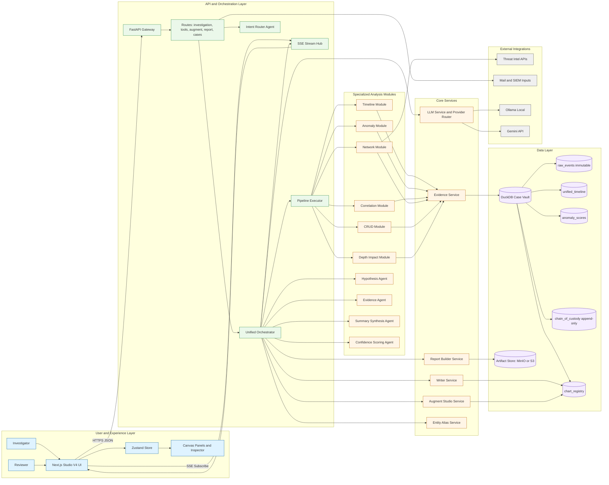
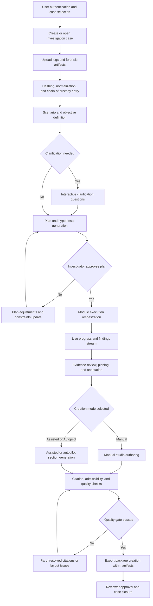
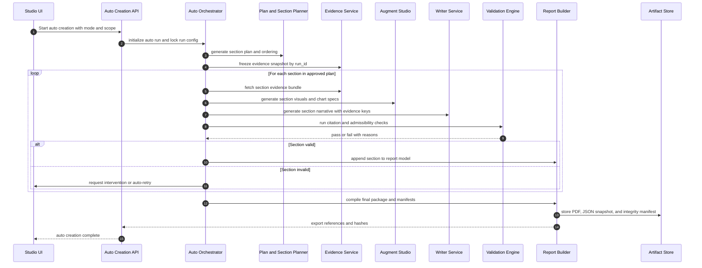
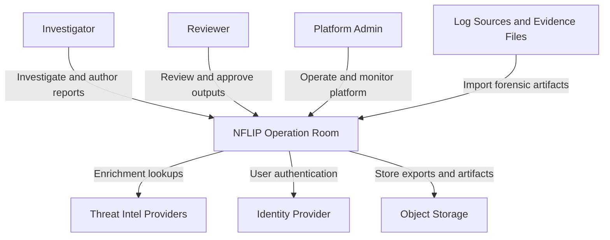
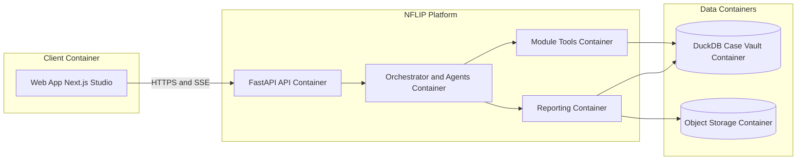
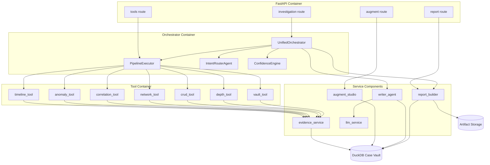
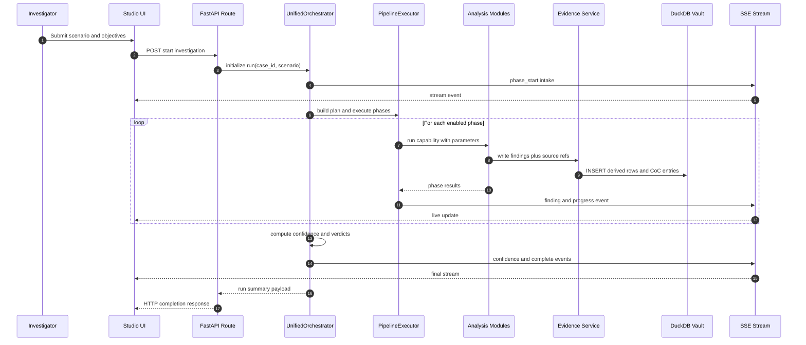
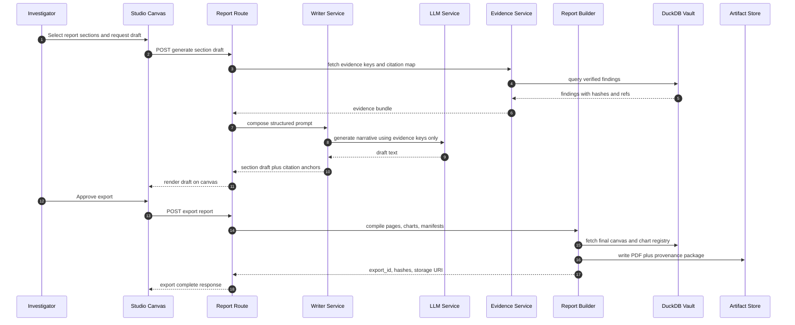

# NFLIP Detailed System Design and Workflow Atlas

This document provides the requested detailed system design with module-level connections, full workflows, C4-style component views, sequence diagrams, court admissibility controls, and production readiness checklists.

## 1. Design Objective and Constraints

1. Build an evidence-first DFIR platform where all factual report claims are traceable to immutable evidence.
2. Keep investigation modules independently executable and re-entrant.
3. Preserve chain of custody from ingestion to export.
4. Support both interactive human-in-loop investigations and automated execution modes.
5. Keep report rendering deterministic between Studio canvas and exported artifacts.

## 2. Detailed System Diagram with Micro Connections

### 2.1 Micro Connection Contract Map

| Connection | Protocol | Payload Contract | Reliability Rule | Audit Artifact |
|---|---|---|---|---|
| UI to API gateway | HTTPS | JSON DTOs with case_id, run_id, module config | Retry on 5xx with idempotency token | API request log |
| API to SSE hub | In-process event bus | phase_start, finding, confidence, complete | Ordered by sequence number | stream_event log |
| Orchestrator to module tools | Async function calls | capability plus parameters map | Timeout per tool plus fallback | module_execution record |
| Module to Evidence Service | Internal service call | evidence rows, source refs, hashes | Transaction boundary per batch | evidence_write CoC entry |
| Evidence Service to DuckDB | SQL | append or create derived table operations | Never update raw_events | DB statement audit |
| Writer to LLM Service | Prompt RPC | constrained prompt with evidence keys | strict temperature and token limits | prompt and response metadata |
| Report Builder to Artifact Store | Object API | PDF, JSON snapshot, provenance manifest | content hash verification | export manifest |
| Network module to Threat Intel | HTTPS | IOC query bundles | circuit breaker and cache | enrichment log |

### 2.2 Module Working Model

1. Intake parses scenario and input evidence inventory.
2. Planning generates hypotheses and phase order.
3. Execution runs modules in dependency-safe order.
4. Evidence service materializes derived outputs and anchors source references.
5. Confidence service scores findings using weighted factors.
6. Writer service composes narrative from verified evidence keys.
7. Report builder assembles studio layout, citations, and export package.

### 2.3 Complete User Flow Across the Platform

The end-to-end user flow combines human control points with automated system actions so investigators can run either manual, assisted, or near-autopilot investigations.

### 2.4 Auto Creation Modes and Control Levels

| Mode | Who drives composition | System behavior | Human approval points |
|---|---|---|---|
| Manual | Investigator | Tools and studio assist only | Per action, per section, per export |
| Assisted | Investigator plus AI | AI drafts sections and visuals, human edits | Per section and final export |
| Autopilot | System with governance gates | System generates structure, narrative, visuals, and package | Final approval plus exception handoffs |

### 2.5 Auto Creation Orchestration Sequence

### 2.6 Auto Creation Micro Workflow Contracts

| Stage | Input contract | Output contract | Failure handling | Audit evidence |
|---|---|---|---|---|
| Auto run initialization | case_id, mode, scope, run configuration | run_id, locked configuration snapshot | Reject if case lock or policy conflict | run_manifest |
| Section planning | objectives, findings inventory, template profile | ordered section_plan | Fallback to baseline template | planner_log |
| Evidence freeze | run_id, evidence selectors | evidence_snapshot_id, hash manifest | Retry with backoff, then fail closed | evidence_snapshot_log |
| Visual generation | section intent plus evidence bundle | chart specs, layout hints | Degrade to table visualization | chart_generation_log |
| Narrative generation | section plan plus evidence keys | section draft with citation anchors | Reject if citation mismatch | prompt_response_audit |
| Validation gate | draft, charts, citation map | pass_fail plus remediation actions | Open intervention task | admissibility_check_log |
| Package export | validated report model | PDF, JSON, manifest, signature | Keep draft state and block publish | export_manifest |

### 2.7 User Flow by Persona

1. Investigator flow:
- Create or open case.
- Import evidence and define objectives.
- Approve plan and execution mode.
- Review findings and generated sections.
- Approve final export.

2. Reviewer flow:
- Open generated package.
- Verify citation integrity and legal formatting.
- Approve or return for revision.

3. Platform admin flow:
- Monitor pipeline health and queue depth.
- Enforce retention, key rotation, and policy controls.
- Audit exception events and failed admissibility checks.

## 3. C4-Style Component Model

### 3.1 C4 Level 1 - System Context

### 3.2 C4 Level 2 - Container View

### 3.3 C4 Level 3 - Backend Component View

## 4. Sequence Diagrams

### 4.1 Investigation Sequence

### 4.2 Report Generation Sequence

## 5. Court Admissibility Controls by Service Boundary

| Service Boundary | Admissibility Objective | Mandatory Controls | Proof Artifact | Verification Action |
|---|---|---|---|---|
| Browser to API | Authenticated and attributable user actions | Strong auth, RBAC, request signing, session binding | access log with user and case scope | Verify user id and role for every write |
| API to Orchestrator | Deterministic execution intent | run_id generation, immutable run config snapshot | run_manifest | Recompute run hash and compare |
| Orchestrator to Modules | Reproducible analytical transformations | versioned module id, capability id, parameter capture | module_execution_log | Replay with same inputs and compare outputs |
| Modules to Evidence Service | Traceable source-to-finding lineage | source_ref list, row hash, operation type | evidence_lineage map | Validate all finding rows have source references |
| Evidence Service to DuckDB | Raw evidence immutability and CoC continuity | write guards, append-only CoC, raw_events no update policy | chain_of_custody rows | Assert no UPDATE or DELETE on raw_events |
| Writer Service to LLM Service | No fabricated facts in narrative | evidence-key constrained prompting, low temperature, citation post-check | prompt_response_audit | Reject draft if unresolved citations exist |
| Report Builder to Artifact Store | Export integrity and reproducibility | export manifest hash, digital signature, timestamping | signed_manifest and PDF hash | Verify PDF hash equals manifest hash |
| API to External Intel | Controlled enrichment provenance | source labeling, confidence tagging, cache of responses | enrichment_audit log | Mark non-primary evidence as contextual only |

### 5.1 Evidence Handling Policy

1. raw_events is immutable after ingestion.
2. chain_of_custody is append-only.
3. Derived tables are versioned by run_id.
4. Every report claim must include one or more citation anchors.
5. Reports failing citation integrity are blocked from final export.

## 6. Production Readiness Checklist

### 6.1 Shared Readiness Baseline

- [ ] End-to-end health checks for API, UI, and storage are green.
- [ ] Evidence immutability tests pass.
- [ ] Chain-of-custody append-only tests pass.
- [ ] Module regression suite passes against reference cases.
- [ ] Export reproducibility test passes for golden sample report.
- [ ] Alerting exists for failed runs, export failures, and storage errors.
- [ ] Disaster recovery drills validated restore objective and recovery objective targets.

### 6.2 Self-Hosted Deployment Checklist

- [ ] Network segmentation isolates UI, API, and storage planes.
- [ ] Private key management uses internal HSM or equivalent.
- [ ] Local object storage replication tested across nodes.
- [ ] Offline backup policy covers case vault and export artifacts.
- [ ] Patch management SLA for host OS and containers is enforced.
- [ ] SIEM forwarding for audit and CoC logs is active.
- [ ] Legal hold workflow for exported reports is documented.

### 6.3 SaaS Deployment Checklist

- [ ] Tenant isolation controls validated at API and data layers.
- [ ] Region and data residency controls configured per contract.
- [ ] Managed key service with customer key option enabled where required.
- [ ] Centralized observability with tenant-safe redaction in logs.
- [ ] Autoscaling policies tested under burst investigative workloads.
- [ ] Incident response runbooks include cross-tenant blast radius checks.
- [ ] Compliance evidence package generation is automated per release.

### 6.4 Go-Live Gates

1. Security sign-off.
2. Forensic admissibility sign-off.
3. Performance sign-off under target load.
4. Operations and support handoff completion.
5. Final legal and governance approval for jurisdiction-specific use.

## 7. Traceability Matrix

| Requirement | Section in this document |
|---|---|
| Detailed system design with micro connections | Section 2 and Section 2.1 |
| Complete user flow and auto creation process | Section 2.3 to Section 2.7 |
| C4-style component model | Section 3 |
| Investigation and report sequence diagrams | Section 4 |
| Court admissibility controls per boundary | Section 5 |
| Production readiness for self-hosted and SaaS | Section 6 |
