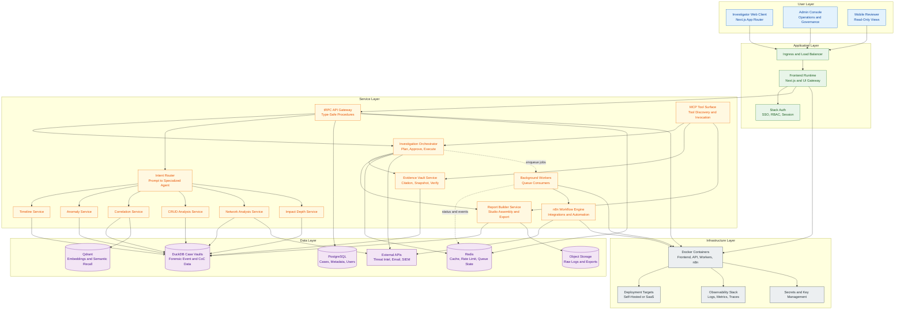

# Epic Architecture Specification: Complete Operation Room Platform

## 1. Epic Architecture Overview

This epic delivers a unified, evidence-first investigation platform that combines forensic ingestion, AI-assisted planning, modular analytics, human-in-loop workflows, and court-ready reporting into a single production architecture.

The technical approach uses a domain-driven modular system:
- Frontend application for investigation and report studio workflows.
- Type-safe API gateway and domain services for investigation execution.
- Specialized analysis modules for timeline, anomaly, correlation, CRUD, network, and impact-depth computation.
- Evidence and chain-of-custody foundation to ensure cryptographic integrity and admissibility.
- Asynchronous orchestration for long-running tasks and interactive approval gates.

The architecture supports both self-hosted and SaaS deployment models, with all services containerized using Docker and orchestrated as independently scalable components.

## 2. System Architecture Diagram

## 3. High-Level Features and Technical Enablers

### High-Level Features

1. Evidence-first investigation intake with scenario-aware context initialization.
2. Deep Research-style visible planning with editable investigation phases.
3. Approval-gated phase execution with real-time progress updates.
4. Intent-routed domain chat across timeline, anomaly, correlation, CRUD, network, and depth analysis.
5. Integrated Evidence Vault operations: ingest, verify, cite, query, snapshot, and anchor.
6. Chain-of-custody-preserving analytics over immutable forensic event history.
7. Studio-based report authoring with canvas placement validation and deterministic exports.
8. Continuous hypothesis generation and testing against collected evidence.
9. Multi-source forensic parsing and normalization with cryptographic event hashing.
10. Compliance-ready final report generation with traceable claim-to-evidence linkage.

### Technical Enablers

1. Domain service decomposition aligned to bounded contexts (Investigation, Evidence, Analysis, Reporting, Auth).
2. tRPC contract layer for end-to-end typed request/response between frontend and services.
3. Stack Auth integration for SSO, user identity, case-level RBAC, and auditable sessions.
4. Redis-backed asynchronous job orchestration and streaming execution state.
5. n8n workflow engine for external integration automation and enrichment.
6. Qdrant semantic retrieval for context expansion and evidence-aware narrative support.
7. Containerized runtime profile for frontend, API, workers, and workflow services.
8. Observability baseline (metrics, traces, structured logs, operation audit trails).
9. Deployment topology parity for self-hosted and SaaS modes.
10. Governance controls including hook guardrails, risky-command interception, and sensitive-path protection.

## 4. Technology Stack

1. Frontend: Next.js (App Router), TypeScript, Zustand, TailwindCSS, Studio canvas components.
2. API and Service Layer: TypeScript server with tRPC procedures and domain modules.
3. Authentication and Authorization: Stack Auth with RBAC and session enforcement.
4. Workflow and Automation: n8n for event-driven and scheduled workflows.
5. Data Stores:
- PostgreSQL for product metadata, users, and operational records.
- DuckDB for case-scoped forensic vault data and analytical queries.
- Qdrant for vector indexing and semantic evidence retrieval.
- Redis for cache, queue state, and short-lived coordination data.
6. AI and Analysis Runtime: LLM provider abstraction, ML anomaly pipelines, explainability workflows.
7. Infrastructure: Dockerized services, reverse proxy/load balancing, observability, secrets management.
8. Dev Productivity: VS Code customization set, MCP integration surface, guarded automation hooks.

## 5. Technical Value

Technical Value: High

Justification:
1. Consolidates currently distributed investigation and reporting capabilities into a cohesive, modular architecture.
2. Reduces operational risk with strong chain-of-custody and evidence integrity guarantees.
3. Increases developer velocity via typed contracts, containerized parity, and standardized workflows.
4. Enables scalable enterprise adoption across both on-prem and SaaS deployment models.
5. Improves trustworthiness through transparent planning, approval gates, and evidence-backed outputs.

## 6. T-Shirt Size Estimate

Estimate: XL

Rationale:
1. Multi-domain service integration with strict forensic integrity constraints.
2. Significant frontend and workflow orchestration scope (interactive planning, interrupts, report assembly).
3. Dual deployment model requirements (self-hosted and SaaS) with secure operational posture.
4. High testing and verification burden across analytics correctness, evidence provenance, and export fidelity.

## Context Source (Epic PRD Basis)

This architecture specification is based on the existing project PRD-equivalent and gap-analysis artifacts for the complete application scope:
1. Operation Room product architecture and workflow guide.
2. Deep research complete architecture guide.
3. Vision versus architecture gap analysis and execution priorities.
