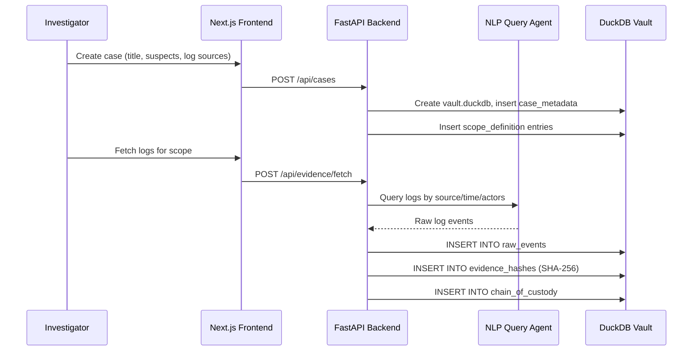

# Module 1: Case Initialization & Evidence Preservation

> The foundation layer — everything starts here. This module creates the forensic case, imports logs, computes integrity hashes, and maintains the chain-of-custody ledger.

## What It Does



## Key Components

| File | Purpose |
|------|---------|
| `services/case_service.py` | Case CRUD, vault creation, metadata management |
| `services/evidence_service.py` | Log import, hashing, batch management |
| `services/audit_service.py` | Chain-of-custody recording (append-only) |
| `services/nlp_agent.py` | NLP query agent client (mock data for dev) |
| `utils/hashing.py` | SHA-256/SHA-512/BLAKE2b hash utilities |
| `routes/cases.py` | Case API endpoints |
| `routes/evidence.py` | Evidence import/export endpoints |

## DuckDB Schema

| Table | Role |
|-------|------|
| `case_metadata` | One row per case — title, status, classification, lead |
| `scope_definition` | Log sources, time ranges, target actors per case |
| `raw_events` | Imported log events (immutable after import) |
| `evidence_hashes` | SHA-256 hash per import batch for tamper detection |
| `chain_of_custody` | Append-only audit trail of every action on evidence |

## Forensic Integrity Principles

1. **Never modify originals** — `raw_events` is write-once. All analysis works on copies/JOINs
2. **Hash everything** — Every import batch gets a SHA-256 hash stored in `evidence_hashes`
3. **Chain-of-custody** — Every action (import, hash, export) is logged with actor, timestamp, justification, and before/after hashes
4. **Case isolation** — Each case has its own DuckDB file at `data/cases/{case_id}/vault.duckdb`

## Connection to Other Modules

```
Case Init ──→ Timeline Reconstruction
  │              (reads raw_events, writes unified_timeline)
  │
  ├──→ Anomaly Detection
  │              (reads unified_timeline, writes anomaly_scores)
  │
  └──→ Correlation & RCA
                 (reads everything, writes entity graph + narrative)
```

- **Timeline** reads from `raw_events` → normalises → writes to `unified_timeline`
- **Anomaly Detection** reads from `unified_timeline` → writes to `anomaly_scores`
- **Correlation** JOINs `unified_timeline` + `anomaly_scores` → builds entity graph

## API Endpoints

| Method | Path | Description |
|--------|------|-------------|
| `POST` | `/api/cases` | Create a new case |
| `GET` | `/api/cases` | List all cases |
| `GET` | `/api/cases/{id}` | Get case details |
| `POST` | `/api/evidence/fetch` | Import logs for a scope entry |
| `GET` | `/api/evidence/{case_id}/hashes` | Get import hashes |
| `GET` | `/api/audit-log` | Get chain-of-custody entries |

## Improvement Ideas

### 1. Real NLP Query Agent
Replace the mock `nlp_agent.py` with a production agent:
- **LangChain SQL Agent** → converts natural language to DuckDB SQL
- **Elasticsearch connector** → pull logs from ELK stack
- **Splunk HEC** → ingest from Splunk via HTTP Event Collector

### 2. Multi-Format Log Parsers
Add pluggable parsers for:
- **Syslog** (RFC 5424), **Windows Event Log** (EVTX), **AWS CloudTrail** (JSON)
- **CEF** (Common Event Format), **LEEF** (Log Extended Event Format)
- Use a parser registry pattern so new formats can be added without touching core

### 3. Evidence Encryption at Rest
- Encrypt vault.duckdb files with AES-256
- Key management via hardware security module (HSM) or AWS KMS
- Decrypt only during active investigation sessions

### 4. Digital Signatures
- Sign each chain-of-custody entry with the investigator's X.509 certificate
- Enables non-repudiation — proves who performed each action
- Required for court-admissible evidence in many jurisdictions

### 5. Distributed Storage
- Move vault files to S3-compatible object storage for scalability
- DuckDB supports `httpfs` extension for remote Parquet/CSV reads
- Enables multi-investigator concurrent access with row-level locking
