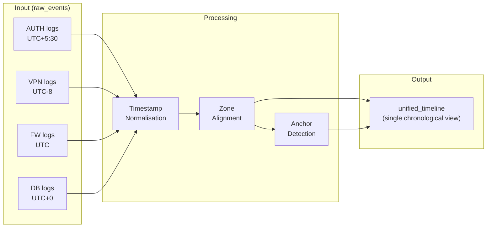

# Module 2: Timeline Reconstruction Helper

> Merges diverse logs from multiple systems into a single normalised chronological view — the investigator's primary tool for understanding "what happened when."

## What It Does



## Key Components

| File | Purpose |
|------|---------|
| `services/timeline_service.py` | Core timeline logic — normalisation, merge, anchor detection |
| `routes/timeline.py` | API endpoints for timeline operations |
| `models/timeline.py` | Pydantic models for timeline data |
| `components/TimelineCharts.js` | Frontend visualisation components |
| `app/cases/[id]/timeline/page.js` | Timeline UI with filters, grouping, zoom |

## How It Works

### 1. Timestamp Normalisation
- Parses timestamps from multiple formats (ISO 8601, Unix epoch, custom patterns)
- Converts all timestamps to UTC with preserved `utc_offset` for display
- Handles clock skew by detecting offset patterns across sources

### 2. Event Merge
- Reads `raw_events` from DuckDB
- Deduplicates by `(source_system, timestamp, actor, action)` tuple
- Writes normalised events to `unified_timeline` table

### 3. Anchor Detection
- Auto-detects significant events: first login, privilege escalation, data export
- Marks events with `is_anchor = TRUE` and stores in `anchor_events` table
- Anchors become reference points for investigators to pivot around

## DuckDB Schema

| Table | Role |
|-------|------|
| `unified_timeline` | Normalised, merged events (source of truth for downstream modules) |
| `anchor_events` | Key events flagged by auto-detection or investigator |

## Connection to Other Modules

```
Case Init ──→ [raw_events] ──→ Timeline Reconstruction
                                     │
                                     ├──→ unified_timeline ──→ Anomaly Detection
                                     │                              │
                                     └──→ unified_timeline ──→ Correlation & RCA
                                                                (+ anomaly_scores)
```

- **Upstream:** Reads `raw_events` populated by Case Init
- **Downstream:** `unified_timeline` is consumed by every analysis module
- **Anomaly Detection** uses timeline events for feature extraction
- **Correlation** JOINs timeline with anomaly scores to build the entity graph

## API Endpoints

| Method | Path | Description |
|--------|------|-------------|
| `POST` | `/api/cases/{id}/timeline/build` | Build/rebuild unified timeline |
| `GET` | `/api/cases/{id}/timeline` | Get timeline events (with filters) |
| `GET` | `/api/cases/{id}/timeline/anchors` | Get anchor events |
| `POST` | `/api/cases/{id}/timeline/anchor` | Create manual anchor |

## Frontend Features

- **Chronological view** with zoom in/out (hour, day, week granularity)
- **Filters** by source type, severity, actor
- **Grouping** by source or actor for multi-stream comparison
- **Anchor markers** — visual pins on key events
- **Event detail panel** — click to see full event data

## Improvement Ideas

### 1. Apache Arrow / Parquet Integration
- For cases with 100K+ events, switch from in-memory DuckDB queries to columnar Parquet scans
- DuckDB natively supports Parquet — just change the storage layer
- Enables out-of-core processing for massive log volumes

### 2. Fuzzy Timestamp Matching
- Use Levenshtein distance on timestamps to detect clock-skewed duplicates
- Example: Server A logs `14:05:03` and Server B logs `14:05:05` for the same event
- Apply Bayesian inference to estimate true event time across sources

### 3. KronoGraph / Planby Integration
- Replace custom timeline UI with **KronoGraph** (Cambridge Intelligence) for enterprise-grade swimlane timelines
- **Planby** for Gantt-style views showing session durations and parallel activity
- These libraries handle 100K+ events efficiently with virtualised rendering

### 4. Automated Pattern Recognition
- Train a sequence model (LSTM or Transformer) to detect common attack patterns:
  - **Brute force** → rapid LOGIN_FAILED followed by LOGIN_SUCCESS
  - **Lateral movement** → user authenticates from new host within minutes
  - **Data staging** → FILE_COPY events preceding EXPORT events
- Overlay pattern matches as annotations on the timeline

### 5. Cross-Case Timeline Correlation
- Compare timelines across multiple cases to detect related campaigns
- If the same IP or actor appears in multiple cases within a time window → alert
- Requires a global index across vault files (a lightweight SQLite meta-database)

### 6. Video-Style Playback
- "Play" the timeline like a video — animate events appearing at real speed or 10x/100x
- Helps investigators intuitively grasp tempo changes (burst of activity = attack phase)
- Use `requestAnimationFrame` with throttled event rendering
