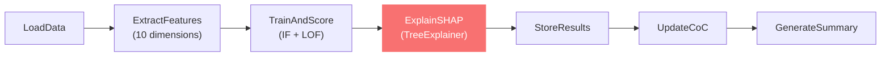

# Module 3: Anomaly Detection Agent

> Unsupervised ML pipeline orchestrated by LangGraph — uses Isolation Forest + LOF ensemble with SHAP explainability to flag suspicious events without labelled training data.

## What It Does



## Key Components

| File | Purpose |
|------|---------|
| `services/anomaly_agent.py` | 7-node LangGraph pipeline + public API |
| `routes/anomaly.py` | FastAPI endpoints for detection |
| `app/cases/[id]/anomalies/page.js` | Premium UI with SHAP visualisation |

## LangGraph Pipeline (7 Nodes)

### Node 1: LoadData
- Reads `unified_timeline` from the case vault
- Applies source/actor filters
- Registers run in `anomaly_runs` table

### Node 2: ExtractFeatures
Extracts **10 numeric features** from each event:

| Feature | Description | Forensic Significance |
|---------|-------------|-----------------------|
| `timestamp_numeric` | Unix timestamp | Events at unusual times |
| `hour_of_day` | Hour (0-23) | After-hours activity = insider threat indicator |
| `day_of_week` | Day (0-6) | Weekend access in enterprise = suspicious |
| `actor_encoded` | Label-encoded user | Rare actors on critical systems |
| `source_encoded` | Label-encoded source | Cross-source patterns = lateral movement |
| `action_encoded` | Label-encoded action | Unusual action types |
| `severity_numeric` | 1=INFO, 2=MED, 3=HIGH | High severity events |
| `target_length` | Target field length | Long targets = encoded data / exfil payloads |
| `actor_frequency` | Events per actor | Low-frequency actors doing critical things |
| `source_frequency` | Events per source | Rare sources at critical moments |

### Node 3: TrainAndScore
- **Isolation Forest** (60% weight) — isolates anomalies via random partitioning
- **Local Outlier Factor** (40% weight) — measures local density deviation
- Ensemble score normalised to `[0, 1]` where `1 = most anomalous`
- Threshold: top percentile based on `contamination` parameter

### Node 4: ExplainSHAP ⭐
- **SHAP TreeExplainer** on the trained Isolation Forest model
- **Global importance:** Mean |SHAP| per feature — which features matter most
- **Per-event explanations:** Top 15 anomalies get feature-by-feature SHAP waterfall
- Each feature has a human-readable `FEATURE_DESCRIPTIONS` dict for UI tooltips

### Node 5: StoreResults
- Writes `anomaly_scores` table (per-event score, is_anomaly flag)
- Idempotent: deletes previous scores for the same run_id before re-inserting

### Node 6: UpdateCoC
- SHA-256 hashes all scores
- Records chain-of-custody event

### Node 7: GenerateSummary
- Stats: mean, std, min, max, p50, p90, p95
- Top 10 anomalies with event details
- Source/actor anomaly breakdown
- SHAP global importance + per-event explanations
- Stored as `summary_json` in `anomaly_runs`

## DuckDB Schema

| Table | Role |
|-------|------|
| `anomaly_runs` | Run metadata — model type, params, status, summary |
| `anomaly_scores` | Per-event scores linked to `unified_timeline` |

## Connection to Other Modules

```
         unified_timeline
              │
              ▼
    ┌─────────────────────┐
    │  Anomaly Detection  │
    │   (LangGraph 7N)    │
    └─────────┬───────────┘
              │
              ▼
         anomaly_scores
              │
              ▼
    ┌─────────────────────┐
    │  Correlation & RCA  │
    │   (reads scores     │
    │    to weight nodes) │
    └─────────────────────┘
```

- **Upstream:** Reads `unified_timeline` from Timeline Reconstruction
- **Downstream:** `anomaly_scores` feed into Correlation's severity scoring (40% weight)
- SHAP explanations power the "Why is this anomalous?" investigator experience

## API Endpoints

| Method | Path | Description |
|--------|------|-------------|
| `POST` | `/api/cases/{id}/anomalies/run` | Execute detection pipeline |
| `GET` | `/api/cases/{id}/anomalies` | Get scored events |
| `GET` | `/api/cases/{id}/anomalies/summary` | Get JSON summary + SHAP |
| `GET` | `/api/cases/{id}/anomalies/runs` | List past runs |

## Frontend Features

| Tab | Features |
|-----|----------|
| **Overview** | Stats cards, **Anomaly Score Timeline** (Recharts scatter — each dot is an event plotted by time vs score, red=anomaly), **Source Anomaly Donut** (Recharts pie — anomalies by log source), **Actor Anomaly Rate Bar** (Recharts stacked bar — anomalies vs normal per actor), top anomalies list |
| **SHAP Explainability** | Global feature importance chart, per-event SHAP waterfall panels with interpretations |
| **Scored Events** | Full table with anomaly-only filter, severity badges, score heat colors |
| **Run History** | Past detection runs with model/params/results |

Every element has hover tooltips explaining what it means for investigators.

## Improvement Ideas

### 1. Neo4j + GraphRAG for Deep Anomaly Analysis
**The big one.** Instead of storing anomaly results in flat DuckDB tables:
- Push scored events into **Neo4j** as a property graph
- Run **Graph RAG** (Retrieval-Augmented Generation) over the graph:
  - LLM queries Neo4j via Cypher to answer "What are all anomalies connected to user X?"
  - Graph traversals find multi-hop attack chains that flat SQL can't express
- **Why this matters:** Anomalies don't exist in isolation — an anomalous login becomes critical when followed by anomalous data access from the same session, which is trivial to query in a graph but requires complex JOINs in SQL

```
Example Cypher:
MATCH (u:User)-[:LOGGED_IN_FROM]->(ip:IP)-[:ACCESSED]->(d:Data)
WHERE u.anomaly_score > 0.7 AND d.sensitivity = 'HIGH'
RETURN u, ip, d
```

### 2. Online/Streaming Anomaly Detection
- Replace batch mode with **River ML** (online learning library):
  - Model updates incrementally as new logs arrive
  - No need to retrain from scratch
  - Sub-second scoring for real-time alerts
- Use **Kafka** or **Redis Streams** as the event backbone

### 3. Autoencoder-Based Detection
- Add a **deep autoencoder** (PyTorch) as an alternative model:
  - Train on normal events → high reconstruction error = anomaly
  - Better at detecting novel attack patterns that IF/LOF miss
  - Especially effective for high-dimensional feature spaces

### 4. Temporal Anomaly Detection
- Current features are per-event. Add **sequence-aware** models:
  - **LSTM Autoencoder** — detect anomalous sequences of events
  - **Hidden Markov Models** — detect state transitions that violate normal patterns
  - This catches attacks that span multiple events (e.g., login → recon → exfil)

### 5. Active Learning Loop
- When investigators confirm/reject anomaly flags, feed this back:
  - Build a labelled dataset over time
  - Train a **supervised classifier** (XGBoost, LightGBM) that gets better with each case
  - Hybrid: unsupervised for initial scan, supervised for refinement

### 6. SHAP Interaction Effects
- Current SHAP shows main effects. Add **SHAP interaction values**:
  - `shap.TreeExplainer(model).shap_interaction_values(X)`
  - Shows which feature *pairs* drive anomalies (e.g., "high severity + late hour")
  - Visualise as heatmap matrix in the UI

### 7. Anomaly Clustering
- After scoring, cluster anomalies using **DBSCAN** or **HDBSCAN**:
  - Group related anomalies into "incidents"
  - Reduces alert fatigue (25 anomalies → 3 clusters)
  - Each cluster becomes a candidate incident to investigate
