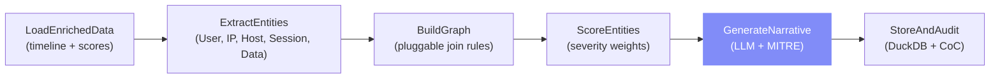

# Module 4: Correlation & Root-Cause Analysis

> The intelligence layer — connects entities across all logs into a graph, applies AI-driven root-cause analysis with MITRE ATT&CK mapping, and provides an interactive chat interface for investigator queries.

## What It Does



## Key Components

| File | Purpose |
|------|---------|
| `services/correlation_agent.py` | 6-node LangGraph pipeline + chat agent |
| `services/llm_provider.py` | Switchable LLM: Ollama (Qwen3) ↔ Gemini |
| `routes/correlation.py` | 7 API endpoints |
| `app/cases/[id]/correlation/page.js` | 6-tab UI with 2D/3D graph views + Recharts analytics |

## LangGraph Pipeline (6 Nodes)

### Node 1: LoadEnrichedData
```sql
SELECT t.*, COALESCE(s.anomaly_score, 0) as anomaly_score
FROM unified_timeline t
LEFT JOIN anomaly_scores s ON t.tl_event_id = s.tl_event_id
```
- JOINs timeline + latest anomaly scores + anchor events
- Seeds default join rules if empty
- Registers correlation run

### Node 2: ExtractEntities
Parses 5 entity types from events:

| Entity Type | Source | Example |
|------------|--------|---------|
| **USER** 👤 | `actor` field | `jdoe`, `admin`, `svc_backup` |
| **IP** 🌐 | `detail.source_ip`, `detail.destination_ip` | `10.0.1.45`, `203.0.113.12` |
| **HOST** 🖥️ | `source_system` field | `dc01`, `vpn-gw`, `db-prod-01` |
| **SESSION** 🔑 | `detail.session_id` | `a3f8b2c1` |
| **DATA_OBJECT** 📁 | `target` field | `/data/customers`, `/data/accounts` |

Each node tracks: event count, anomaly scores, first/last seen, actions, sources.

### Node 3: BuildGraph
Applies **pluggable join rules** to create edges:

| Rule | Join Field | Relationship | Window |
|------|-----------|--------------|--------|
| Same Actor | `actor` | PERFORMED | 60min |
| Same Source IP | `source_ip` | AUTHENTICATED_FROM | 30min |
| Same Dest IP | `destination_ip` | CONNECTED_TO | 30min |
| Same Session | `session_id` | USED_SESSION | 120min |
| Same Target | `target` | ACCESSED | 10min |
| Same Host | `source_system` | EXECUTED_ON | 60min |

Rules are **toggleable** from the frontend.

### Node 4: ScoreEntities
Weighted severity formula:

```
severity = 0.4 × anomaly_component + 0.3 × privilege_component + 0.3 × frequency_component
```

- **Anomaly component:** Mean anomaly score from IF+LOF
- **Privilege component:** Fraction of privileged actions (DELETE, EXPORT, PASSWORD_CHANGE, etc.)
- **Frequency component:** Graph connectivity (edge count / max edges)

### Node 5: GenerateNarrative (LLM) 🧠
Sends top entities, connections, and anomalous events to the LLM:

| LLM Provider | Model | Use Case |
|-------------|-------|----------|
| **Ollama** | Qwen3 (local) | Default — fast, private, no API key |
| **Gemini** | gemini-2.0-flash | More powerful, requires API key |

The LLM generates a structured narrative with:
1. **Executive Summary**
2. **Attack Timeline**
3. **MITRE ATT&CK Mapping** (14 action→tactic mappings)
4. **Critical Entities**
5. **Root Cause**
6. **Recommendations**

If the LLM is unavailable, a **fallback narrative** is generated algorithmically.

### Node 6: StoreAndAudit
- Writes nodes/edges to `correlation_nodes`, `correlation_edges`
- Stores narrative in `rca_narratives`
- SHA-256 hashes the full graph
- Records chain-of-custody

## MITRE ATT&CK Mapping

| Action | Tactic |
|--------|--------|
| LOGIN_SUCCESS, VPN_CONNECT | TA0001: Initial Access |
| MALWARE_DETECTED, PROCESS_BLOCKED | TA0002: Execution |
| PASSWORD_CHANGE, FILE_WRITE, CREATE_TABLE | TA0003: Persistence |
| DROP | TA0005: Defense Evasion |
| LOGIN_FAILED, MFA_CHALLENGE, ACCOUNT_LOCKED | TA0006: Credential Access |
| SELECT, FILE_READ | TA0009: Collection |
| EXPORT, FILE_COPY | TA0010: Exfiltration |
| ALLOW, HTTP_POST | TA0011: Command and Control |
| DELETE, ERROR_500 | TA0040: Impact |

## DuckDB Schema

| Table | Role |
|-------|------|
| `correlation_runs` | Run metadata, status, hash |
| `correlation_nodes` | Entity graph nodes |
| `correlation_edges` | Entity relationships |
| `rca_narratives` | AI-generated root-cause reports |
| `agent_chat_logs` | Audit trail for AI chat queries |
| `correlation_rules` | Pluggable join rules |

## Connection to Other Modules

```
┌────────────────────┐     ┌─────────────────────┐
│  Case Init         │     │  Timeline Recon      │
│  (raw_events,      │     │  (unified_timeline,  │
│   chain_of_custody)│     │   anchor_events)     │
└────────┬───────────┘     └──────────┬───────────┘
         │                            │
         │    ┌───────────────────┐   │
         │    │ Anomaly Detection │   │
         │    │ (anomaly_scores)  │   │
         │    └────────┬──────────┘   │
         │             │              │
         ▼             ▼              ▼
    ┌─────────────────────────────────────┐
    │     Correlation & RCA Engine        │
    │                                     │
    │  unified_timeline + anomaly_scores  │
    │            ↓                        │
    │  Entity Graph + Severity Scoring    │
    │            ↓                        │
    │  LLM Narrative + MITRE ATT&CK      │
    │            ↓                        │
    │  Interactive Chat + Rules           │
    └─────────────────────────────────────┘
```

This module **consumes outputs from all three upstream modules** and produces the final intelligence product.

## API Endpoints

| Method | Path | Description |
|--------|------|-------------|
| `POST` | `/api/cases/{id}/correlation/run` | Execute pipeline |
| `GET` | `/api/cases/{id}/correlation/graph` | Get nodes + edges |
| `GET` | `/api/cases/{id}/correlation/narrative` | Get AI narrative |
| `POST` | `/api/cases/{id}/correlation/chat` | Chat with AI agent |
| `GET` | `/api/cases/{id}/correlation/runs` | List past runs |
| `GET` | `/api/cases/{id}/correlation/rules` | Get join rules |
| `PUT` | `/api/cases/{id}/correlation/rules/{rule_id}` | Toggle rule |
| `GET` | `/api/cases/{id}/correlation/providers` | List LLM providers |

## Frontend Features

| Tab | Features |
|-----|----------|
| **Entity Graph** | 2D (vis-network) + 3D (react-force-graph-3d) toggle, entity filter by type, severity slider, click-to-inspect entity details |
| **Analytics** | **Entity Type Donut** (Recharts pie — distribution of USER/IP/HOST/SESSION/DATA_OBJECT), **Severity Histogram** (Recharts bar — entities by severity range with color gradient), **Top Entities Bar** (Recharts horizontal bar — highest-severity entities ranked), **Entity Risk Scatter** (Recharts scatter — events vs severity, bubble size = anomaly score) |
| **AI Narrative** | MITRE ATT&CK tactic chips, structured narrative, recommendations list, hash verification |
| **Ask AI** | Chat interface — "Why is user X flagged?", "What happened after 14:05?", audited |
| **Rules** | Toggle switches for each join rule with descriptions |
| **Runs** | Past correlation run history |

## Improvement Ideas

### 1. 🏆 Neo4j Property Graph + GraphRAG
**The single highest-impact improvement for this module.**

Replace the DuckDB flat tables with a **Neo4j** native graph database:

```cypher
// Create entities as nodes
CREATE (u:User {name: 'jdoe', severity: 0.85})
CREATE (ip:IP {address: '10.0.1.45', severity: 0.72})
CREATE (h:Host {name: 'dc01', severity: 0.65})

// Create relationships
MERGE (u)-[:AUTHENTICATED_FROM {weight: 15, first_seen: '2025-01-15T09:00'}]->(ip)
MERGE (u)-[:EXECUTED_ON {weight: 8}]->(h)
MERGE (ip)-[:CONNECTED_TO {weight: 3}]->(h)
```

**Why this is transformative:**
- **Traversal queries** that DuckDB can't do efficiently:
  ```cypher
  // Find all entities within 3 hops of a high-severity user
  MATCH path = (u:User {name: 'jdoe'})-[*1..3]-(connected)
  WHERE u.severity > 0.7
  RETURN path
  ```
- **Graph algorithms** via Neo4j GDS (Graph Data Science):
  - **PageRank** → which entities are most "central" to the attack
  - **Community detection** → automatically group related entities
  - **Shortest path** → find the attack chain from entry to exfiltration
- **GraphRAG** → LLM reads from Neo4j instead of flat context:
  - Better answers because the LLM sees graph structure
  - Cite specific paths: "User X logged in from IP Y at 14:05, then accessed Host Z at 14:08"

**Implementation path:**
1. Install `neo4j` Python driver + spin up Neo4j container
2. After `BuildGraph` node, push nodes/edges to Neo4j
3. Replace `chat_with_agent()` context building with Cypher queries
4. Use `langchain-neo4j` for GraphRAG integration

### 2. Causal Inference Engine
Go beyond correlation to **causation**:
- Use **Granger causality** tests on time series of entity activity
- Apply **DoWhy** library for causal discovery
- Answer: "Did user X's login *cause* the data exfiltration, or was it coincidental?"

### 3. Threat Intelligence Enrichment
Add external intelligence to entity nodes:
- **GeoIP** (MaxMind) → country/ASN for IP nodes
- **VirusTotal** API → file hash reputation
- **AbuseIPDB** → IP reputation score
- **MITRE ATT&CK STIX** → enrich tactic descriptions with technique details

### 4. Multi-Case Correlation
- Correlate entities across multiple cases:
  - Same IP appears in Case A and Case B → campaign indicator
  - Same actor patterns across cases → repeat offender
- Requires a global entity index (Neo4j excels here)

### 5. Dynamic Severity Tuning
- Let investigators drag a **severity weight slider** and see the graph reorder in real-time
- Currently requires a re-run; make scoring client-side with WebWorkers
- Add "what-if" mode: "What if anomaly weight was 70% instead of 40%?"

### 6. Graph Export for Legal Proceedings
- Export graph as **GraphML** (XML standard) for use in external tools
- **Court-ready PDF** with graph snapshots, entity tables, and chain-of-custody
- **STIX/TAXII** export for sharing with law enforcement or ISACs

### 7. Automated Playbook Execution
- Connect recommendations to **SOAR playbooks** (Shuffle, Cortex XSOAR):
  - "Reset credentials" → automatically triggers password reset
  - "Block IP" → pushes rule to firewall API
  - "Isolate host" → triggers EDR containment action
- LangGraph can orchestrate this as additional pipeline nodes

### 8. LLM Comparison Mode
- Run the same narrative prompt through **multiple LLMs** (Ollama + Gemini) simultaneously
- Display side-by-side comparison for the investigator
- Consensus analysis: if both LLMs agree on root cause, confidence is higher
- Use this to validate LLM outputs before including in reports
