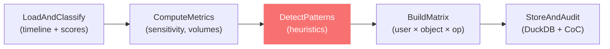

# Module 5: CRUD & Data-Access Analysis

> Classifies every log event as Create/Read/Update/Delete, scores data sensitivity, detects suspicious access patterns, and builds user×object×operation matrices — feeding results back into the Correlation graph and investigator workflows.

## What It Does



## Key Components

| File | Purpose | Reuses From |
|------|---------|-------------|
| `services/crud_agent.py` | 5-node LangGraph pipeline | hashing.py, audit_service.py, anomaly_scores |
| `routes/crud.py` | 4 API endpoints | Same pattern as anomaly/correlation routes |
| `app/cases/[id]/crud/page.js` | 5-tab investigator UI | Tip component, same styling system |

## LangGraph Pipeline (5 Nodes)

### Node 1: LoadAndClassify
- JOINs `unified_timeline` + latest `anomaly_scores`
- Applies **30+ action→CRUD mappings**:

| Action → CRUD | Examples |
|---------------|----------|
| **CREATE** | INSERT, CREATE_TABLE, FILE_WRITE, FILE_COPY, HTTP_POST |
| **READ** | SELECT, FILE_READ, HTTP_GET, EXPORT, LOGIN_SUCCESS |
| **UPDATE** | UPDATE, FILE_RENAME, HTTP_PUT, PASSWORD_CHANGE, QUARANTINE |
| **DELETE** | DELETE, DROP, FILE_DELETE, HTTP_DELETE, PROCESS_BLOCKED |

- Supports optional filters: `source_filters`, `time_start`, `time_end`

### Node 2: ComputeMetrics
Computes per-event:
- **Hour of day**, **day of week**, **is_business_hours**, **is_weekend**
- **Sensitivity weight** (LOW=1, MEDIUM=2, HIGH=3, CRITICAL=4)
- **Risk score** formula:
  ```
  risk = 0.40 × anomaly_score
       + 0.30 × (sensitivity_weight / 4)
       + 0.15 × min(1, volume_bytes / 500000)
       + 0.15 × (1 if off-hours else 0)
  ```

### Node 3: DetectPatterns 🔴
Applies **6 heuristic rules**:

| Rule | Condition | Why It Matters |
|------|-----------|----------------|
| Off-hours bulk reads | READ + hour < 7 or > 20 | Data exfiltration often happens after hours |
| High-sens DELETE | DELETE on CRITICAL/HIGH data | Potential evidence destruction |
| Audit trail tampering | UPDATE/DELETE on audit tables | Classic anti-forensics technique |
| High-anomaly writes | anomaly > 0.7 + CREATE/UPDATE/DELETE | Confirmed anomaly doing destructive ops |
| High-severity reads | severity=HIGH + READ | Flagged event accessing sensitive data |
| Large data reads | bytes > 100KB + READ | Potential bulk data exfiltration |

**Burst detection:** Scans for >10 events by same actor within 5 minutes.

### Node 4: BuildMatrix
- Aggregates events into `(actor, target_object, crud_type)` tuples
- Computes per-tuple: event count, total bytes, total rows, avg anomaly, max sensitivity
- Sorts by risk (high_risk_count desc, then event_count desc)

### Node 5: StoreAndAudit
- Writes to `crud_events` and `crud_summary` tables
- SHA-256 hashes output → `evidence_hashes`
- Records chain-of-custody via `record_coc_event` (reused from Case Init)

## Sensitivity Classification

**11 pattern-based rules** classify targets by data sensitivity:

| Pattern | Level | Reason |
|---------|-------|--------|
| payroll, password, credential, audit | CRITICAL | Financial/security/evidence data |
| customer, user, account, admin | HIGH | PII or privileged data |
| order, config, log | MEDIUM | Business or operational data |
| *(everything else)* | LOW | General data |

## DuckDB Schema

| Table | Role |
|-------|------|
| `crud_runs` | Run metadata, params, CRUD counts, status |
| `crud_events` | Per-event CRUD classification with sensitivity and risk flags |
| `crud_summary` | Aggregated user × object × operation matrices |

## Connection to Other Modules

```
┌──────────────────────┐    ┌──────────────────────┐
│  Timeline Recon      │    │  Anomaly Detection   │
│  (unified_timeline)  │    │  (anomaly_scores)    │
└──────────┬───────────┘    └──────────┬───────────┘
           │                           │
           └──────────┬────────────────┘
                      ▼
         ┌─────────────────────────┐
         │   CRUD & Data-Access    │
         │   Analysis Engine       │
         │                         │
         │  Classify → Metrics →   │
         │  Patterns → Matrix →    │
         │  Store + CoC            │
         └────────────┬────────────┘
                      │
           ┌──────────┼──────────┐
           ▼          ▼          ▼
    ┌────────────┐ ┌────────────┐ ┌────────────┐
    │ Correlation│ │  Report    │ │  Network   │
    │ & RCA      │ │  Writer    │ │  / Exfil   │
    └────────────┘ └────────────┘ └────────────┘
```

- **Upstream:** Reads `unified_timeline` + `anomaly_scores` from Timeline Reconstruction and Anomaly Detection
- **Downstream:** `crud_events` and `crud_summary` can be consumed by Correlation (to enrich entity nodes with CRUD patterns), Report Writer (to include data-access analysis in reports), and Network/Exfil (to correlate file operations with network traffic)
- **Reuses:** `hash_records()` from `utils/hashing.py`, `record_coc_event()` from `services/audit_service.py`

## API Endpoints

| Method | Path | Description |
|--------|------|-------------|
| `POST` | `/api/cases/{id}/crud/run` | Execute CRUD analysis pipeline |
| `GET` | `/api/cases/{id}/crud/events` | Get classified events (supports `?high_risk_only=true&sensitivity=HIGH&crud_type=DELETE`) |
| `GET` | `/api/cases/{id}/crud/summary` | Get user×object×operation matrix |
| `GET` | `/api/cases/{id}/crud/runs` | List past analysis runs |

## Frontend Features

| Tab | Features |
|-----|----------|----------|
| **Overview** | **CRUD Type Donut** (Recharts pie — CREATE/READ/UPDATE/DELETE proportions), **Sensitivity Donut** (Recharts pie — LOW/MEDIUM/HIGH/CRITICAL), **Actor Stacked Bar** (Recharts horizontal bar — CRUD breakdown per actor) |
| **Temporal** | **Hourly CRUD Activity** (Recharts stacked area — CRUD operations by hour of day, off-hours highlighted), **Risk Events per Hour** (Recharts bar — flagged events by hour) |
| **Actors** | **Actor Behaviour Radar** (Recharts radar — top 5 actors profiled by Creates/Reads/Updates/Deletes/Risk), **Target Risk Bubble Chart** (Recharts scatter — access count vs anomaly, size = risk events, color = sensitivity) |
| **CRUD Matrix** | Aggregated table with actor, target, type, bytes, sensitivity, anomaly, risk count |
| **Events** | Full event list with CRUD type + sensitivity filter buttons |
| **High-Risk** | Expandable risk cards with flagged reason, anomaly score, timeline stamp |
| **Runs** | Past analysis history with CRUD count breakdown |

## Improvement Ideas

### 1. Database Trigger Capture
- Integrate with real database audit logs (pg_audit for PostgreSQL, MySQL audit plugin)
- Capture actual SQL statements, affected row counts, execution plans
- Parse column-level changes (which fields were modified, before/after values)

### 2. File Integrity Monitoring (FIM)
- Integrate with OSSEC, Wazuh, or Tripwire FIM logs
- Track file hash changes: `HASH_CHANGED` → flag as UPDATE, `FILE_CREATED` → CREATE
- Detect unauthorised modifications to configuration files or system binaries

### 3. API Gateway Log Integration
- Parse logs from Kong, Envoy, or AWS API Gateway
- Extract: endpoint, method, request size, response code, latency
- Classify API calls into CRUD and detect unusual patterns (rate spikes, error bursts)

### 4. Temporal Heat Maps
- Build time-of-day × day-of-week heat maps per actor:
  ```
        Mon  Tue  Wed  Thu  Fri  Sat  Sun
  00:00  ░    ░    ░    ██   ░    ░    ░
  06:00  ██   ██   ██   ██   ██   ░    ░
  12:00  ██   ██   ██   ██   ██   ░    ░
  18:00  ██   ██   ██   ██   ██   ░    ░
  ```
- Highlight cells that deviate from the actor's baseline pattern
- Use D3.js calendar heat map visualization

### 5. Data Flow Tracking (DFT)
- Track data objects through CREATE → READ → UPDATE → READ → EXPORT chains
- Build a Sankey diagram showing data lifecycle
- Detect: data created, then immediately read + exported = potential exfiltration

### 6. Machine Learning Pattern Detection
Replace heuristic rules with learned patterns:
- **Sequential Pattern Mining** (PrefixSpan) → discover common CRUD sequences
- **Anomalous sequence detection** → flag sequences that deviate from learned patterns
- Example: normal = `READ → READ → READ`, anomalous = `READ → DELETE → DELETE`

### 7. Role-Based Access Control (RBAC) Validation
- Compare CRUD operations against a defined RBAC policy matrix
- Flag violations: user X should only READ table Y, but performed DELETE
- Integrate with LDAP/AD to automatically pull role definitions

### 8. CRUD Impact Scoring
- Assign impact scores based on what was affected:
  - DELETE on 10 rows of customer data = high impact
  - READ of 1 row of config data = low impact
- Use `row_count × sensitivity_weight` as the base formula
- Sum across events for cumulative impact per actor

### 9. Plugin System for Log Formats
Implement a pluggable parser registry:
```python
class CrudParser(ABC):
    @abstractmethod
    def classify(self, event: dict) -> str: ...  # → "CREATE"|"READ"|"UPDATE"|"DELETE"
    @abstractmethod
    def extract_metadata(self, event: dict) -> dict: ...  # → {rows, bytes, table, ...}

# Register parsers for new log types
registry.register("splunk_audit", SplunkCrudParser())
registry.register("cloudtrail_s3", CloudTrailCrudParser())
```

### 10. Cross-Module CRUD Enrichment
Feed CRUD analysis back into the Correlation engine:
- Add `CRUD_CREATE`, `CRUD_READ`, `CRUD_UPDATE`, `CRUD_DELETE` as edge types in the entity graph
- Weight edges by sensitivity: a user DELETEing CRITICAL data gets a heavier edge
- The AI narrator can then say: "User jdoe performed 15 bulk READs on the payroll table at 02:00, followed by a FILE_COPY — consistent with data exfiltration"
