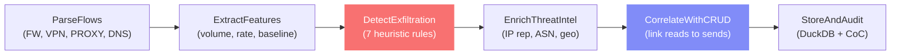

# Module 6: Network & Exfiltration Analysis

> Detects suspicious outbound communications by parsing network flow logs, enriching with threat-intelligence, and cross-referencing with CRUD data reads to confirm data exfiltration.

## What It Does



## Key Components

| File | Purpose |
|------|---------|
| `services/network_agent.py` | 6-node LangGraph pipeline + public API |
| `routes/network.py` | 5 FastAPI endpoints |
| `app/cases/[id]/network/page.js` | 6-tab Recharts dashboard |

## LangGraph Pipeline (6 Nodes)

### Node 1: ParseFlows
- Reads `unified_timeline` for source types: FW, VPN, PROXY, DNS
- Parses `detail` JSON for: `source_ip`, `destination_ip`, `port`, `bytes_sent/received`, `protocol`
- Classifies direction: OUTBOUND (src internal → dst external), INBOUND, INTERNAL
- Uses RFC 1918 ranges for internal IP detection

### Node 2: ExtractFeatures
- **Per-flow:** bytes ratio, duration, business hours, weekend flag
- **Per-actor:** outbound volume z-score (deviation from baseline)
- **Per-destination:** frequency (rare destinations = suspicious)

### Node 3: DetectExfiltration (7 Rules)

| # | Rule | Condition | Forensic Rationale |
|---|------|-----------|--------------------|
| 1 | Large outbound | bytes_sent > 500KB | Bulk data exfiltration |
| 2 | DNS tunnelling | DNS flow with bytes > 10KB | Covert channel via DNS |
| 3 | New destination | External IP not in first 50% of timeline | Attacker infrastructure |
| 4 | Off-hours outbound | 22:00–06:00 + bytes > 50KB | Avoid detection |
| 5 | Beaconing | Regular-interval connections (CV < 0.3) | C2 communication |
| 6 | Volume spike | > 3σ above actor baseline | Abnormal activity |
| 7 | High anomaly + outbound | Anomaly > 0.6 + bytes > 100KB | Confirmed anomalous exfiltration |

### Node 4: EnrichThreatIntel
- Looks up external IPs against known-bad prefixes and ASN/geo database
- Demo enrichment (in production: AbuseIPDB, VirusTotal, MaxMind)
- Flags connections to known malicious infrastructure

### Node 5: CorrelateWithCRUD ⭐
- For each suspicious outbound flow, searches `crud_events` for:
  - Same actor performing READs within 30 minutes before the flow
- Computes **exfiltration confidence**:
  ```
  confidence = 0.3 × volume_match + 0.3 × time_proximity + 0.2 × anomaly_score + 0.2 × threat_score
  ```
- Generates human-readable evidence summaries

### Node 6: StoreAndAudit
- Writes to `network_flows`, `exfil_candidates`, `destination_summary`
- SHA-256 hashes outputs → chain-of-custody

## DuckDB Schema

| Table | Role |
|-------|------|
| `network_runs` | Run metadata, status, total flows, suspicious count |
| `network_flows` | Per-flow records with threat intel and anomaly |
| `exfil_candidates` | Correlated flow + CRUD read pairs |
| `destination_summary` | Aggregated per-destination risk profile |

## Connection to Other Modules

```
┌────────────────────┐     ┌─────────────────────┐
│  Case Init         │     │  Timeline Recon      │
│  (FW/VPN/PROXY     │     │  (unified_timeline)  │
│   raw_events)      │     │                      │
└────────┬───────────┘     └──────────┬───────────┘
         │                            │
         │    ┌───────────────────┐   │
         │    │ Anomaly Detection │   │
         │    │ (anomaly_scores)  │   │
         │    └────────┬──────────┘   │
         │             │              │
         │    ┌────────┴──────────┐   │
         │    │ CRUD Analysis     │   │
         │    │ (crud_events:     │   │
         │    │  READ operations) │   │
         │    └────────┬──────────┘   │
         │             │              │
         ▼             ▼              ▼
    ┌─────────────────────────────────────┐
    │   Network & Exfiltration Engine     │
    │                                     │
    │  Parse flows + Extract features     │
    │            ↓                        │
    │  Detect exfiltration (7 rules)      │
    │            ↓                        │
    │  Enrich with threat-intel           │
    │            ↓                        │
    │  Correlate outbound with CRUD reads │
    │            ↓                        │
    │  Store + Chain-of-Custody           │
    └─────────────────────────────────────┘
```

## API Endpoints

| Method | Path | Description |
|--------|------|-------------|
| `POST` | `/api/cases/{id}/network/run` | Execute network analysis pipeline |
| `GET` | `/api/cases/{id}/network/flows` | Get flows (`?suspicious_only=true&direction=OUTBOUND&protocol=DNS`) |
| `GET` | `/api/cases/{id}/network/exfil` | Get exfiltration candidates |
| `GET` | `/api/cases/{id}/network/destinations` | Get destination risk summaries |
| `GET` | `/api/cases/{id}/network/runs` | List past analysis runs |

## Frontend Features

| Tab | Visualizations |
|-----|---------------|
| **Overview** | Stats cards (6), **Volume Timeline** (Recharts stacked area — outbound/inbound/suspicious per hour), **Protocol Donut** (Recharts pie — TCP/UDP/DNS/HTTP/VPN), **Direction Donut** |
| **Flows** | Filterable table: direction, protocol, suspicious-only toggles. Color-coded external IPs, suspicious row highlighting |
| **Destinations** | **Destination Risk Scatter** (Recharts — X=flow count, Y=threat score, size=bytes, color=known-bad), summary table with threat-intel |
| **Exfiltration** | Expandable cards: evidence summary, CRUD read bytes vs network bytes, time delta, confidence bar |
| **Threat Intel** | Per-IP enrichment table: geo, ASN, org, reputation, threat score bars |
| **Runs** | Past analysis history with flow/suspicious/exfil counts |

## Improvement Ideas

### 1. 🏆 Real Threat-Intelligence APIs
Replace demo enrichment with production feeds:
- **AbuseIPDB** — IP reputation score and abuse reports
- **VirusTotal** — domain/IP scanning with detection results
- **MaxMind GeoIP2** — accurate geolocation and ASN data
- **Shodan** — open ports and service fingerprinting

### 2. Encrypted Traffic Analysis
- Use **JA3/JA3S** TLS fingerprinting to identify suspicious clients
- Detect **domain fronting** (CDN abuse for C2)
- Analyse certificate metadata (self-signed, short-lived = suspicious)

### 3. Zeek/Bro Log Integration
- Add parsers for **Zeek** connection, DNS, and HTTP logs
- Much richer network metadata than firewall logs

### 4. ML Beaconing Detection
- Replace heuristic CV check with **FFT (Fast Fourier Transform)** analysis
- Detects beaconing with jitter (randomised intervals that still have periodicity)

### 5. Network Graph Visualisation
- Add **Sankey diagram** showing flow from internal hosts → protocols → external destinations
- Use **react-force-graph** to render network topology

### 6. DLP Integration
- Cross-reference with **Data Loss Prevention** logs where available
- Match network payload hashes with CRUD export content hashes
