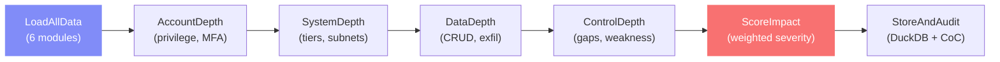

# Module 7: Depth & Impact Assessment

> Quantifies how deeply an attacker penetrated across 4 dimensions (Account, System, Data, Control), computes overall business-impact severity, and generates LLM-powered remediation narratives.

## Pipeline



## Key Components

| File | Purpose |
|------|---------|
| `services/depth_agent.py` | 7-node LangGraph pipeline + LLM narrative |
| `routes/depth.py` | 6 FastAPI endpoints |
| `app/cases/[id]/depth/page.js` | 8-tab Recharts dashboard |

## Depth Dimensions (0–10 Scale)

### Account Depth
| Metric | What It Measures |
|--------|-----------------|
| unique_accounts | Accounts used |
| admin_accounts_used | Admin/root accounts detected |
| privilege_escalation_events | DELETE, EXPORT, PASSWORD_CHANGE etc. |
| logins_without_mfa | Login events without MFA challenge |
| off_hours_anomalous_logins | Off-hours logins with high anomaly score |
| credential_compromise_sequences | Failed → Success login patterns |

### System Depth
| Metric | What It Measures |
|--------|-----------------|
| unique_hosts | Systems accessed |
| unique_subnets | /24 subnets traversed |
| infrastructure_tiers | Tiers reached: web, app, DB, storage, identity, network, endpoint, monitoring |
| lateral_movement_actors | Actors accessing ≥2 hosts |
| dwell_time_hours | Time between first and last event |

### Data Depth
| Metric | What It Measures |
|--------|-----------------|
| sensitive_objects_accessed | HIGH/CRITICAL sensitivity objects from CRUD |
| data_read_bytes | Total bytes from READ operations |
| data_modified_deleted_bytes | Bytes from UPDATE/DELETE |
| high_risk_crud_events | Events flagged high-risk |
| exfiltration_candidates | Network exfil with confidence > 0.4 |
| exfiltrated_bytes | Bytes confirmed sent outbound |
| sensitivity_distribution | CRITICAL/HIGH/MEDIUM/LOW event counts |

### Control Depth
| Metric | What It Measures |
|--------|-----------------|
| missing_mfa_ratio | Logins without MFA / total logins |
| failed_login_attempts | Weak credential indicators |
| unblocked_anomalies | Anomalies without DENY/BLOCK responses |
| suspicious_outbound_allowed | Suspicious flows not blocked |
| off_hours_admin_access | Admin access outside 07:00–20:00 |
| malware_indicators | MALWARE_DETECTED / PROCESS_BLOCKED |

## Scoring Model

```
overall_severity = w_account × account_depth + w_system × system_depth
                 + w_data × data_depth + w_control × control_depth
```

| Score Range | Label |
|-------------|-------|
| 7–10 | CRITICAL |
| 5–7 | HIGH |
| 3–5 | MEDIUM |
| 0–3 | LOW |

Weights are configurable via interactive sliders — default: account=25%, system=25%, data=30%, control=20%.

## Integration With All Modules

```
Case Init ──────→ Raw logs, hash/CoC utilities
Timeline ────────→ Event sequence, dwell time calculation
Anomaly Detection → Anomaly scores amplify depth metrics
Correlation ─────→ Entity graph, severity scores, critical path
CRUD Analysis ───→ Sensitivity tags, volume, high-risk events
Network/Exfil ───→ Confirmed exfiltration, threat scores
```

## API Endpoints

| Method | Path | Description |
|--------|------|-------------|
| `POST` | `/api/cases/{id}/depth/run` | Run depth analysis (accepts `weights`) |
| `GET` | `/api/cases/{id}/depth/results` | Get depth scores |
| `GET` | `/api/cases/{id}/depth/details` | Get per-dimension metrics (`?dimension=ACCOUNT`) |
| `POST` | `/api/cases/{id}/depth/narrative` | Generate LLM narrative |
| `GET` | `/api/cases/{id}/depth/narrative` | Get stored narrative |
| `GET` | `/api/cases/{id}/depth/runs` | List past runs |

## Frontend 8-Tab Dashboard

| Tab | Content |
|-----|---------|
| **Overview** | 4 gauge cards, severity banner with business impact, Radar chart (Recharts), Dimension bar chart |
| **Account** | Metric breakdown with progress bars and evidence |
| **System** | Infrastructure tier heat map (8 tiers, red/green), metric breakdown |
| **Data** | Sensitivity donut chart (Recharts pie), metric breakdown |
| **Control** | Control gap checklist (red/green indicators), metric breakdown |
| **Weights** | Interactive sliders (4 dimensions), live severity recalculation preview |
| **Narrative** | LLM executive summary card, full narrative, prioritised remediation |
| **Runs** | Analysis history with per-dimension scores |

## Improvement Ideas

1. **Weighted Anomaly Amplification** — Higher anomaly scores could multiply (not just add to) depth metrics
2. **MITRE ATT&CK Heat Map** — Map depth dimensions to ATT&CK tactics for compliance reporting
3. **Neo4j Integration** — Query multi-hop attack paths and annotate with depth scores
4. **Time-Series Depth** — Compute depth at hourly intervals to show how penetration deepened
5. **PDF Export** — Auto-generate executive PDF with radar chart and business impact section
