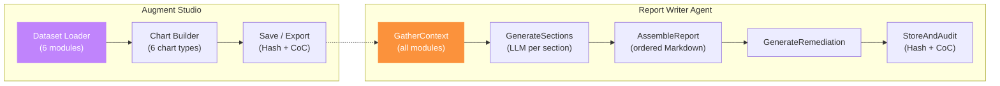

# Module 8: Augment Studio & Report Writer

> Interactive chart builder and AI-powered forensic report generator. Investigators build custom visualisations from all analysis modules, then produce structured, auditable reports for stakeholders.

## Architecture



## Key Components

| File | Purpose |
|------|---------|
| `services/studio_service.py` | 6 dataset aggregators + chart CRUD |
| `services/report_agent.py` | 5-node LangGraph report pipeline |
| `routes/studio.py` | 7 Studio API endpoints |
| `routes/report.py` | 6 Report API endpoints |
| `app/cases/[id]/studio/page.js` | 3-tab chart builder |
| `app/cases/[id]/report/page.js` | 4-tab report editor |

## Augment Studio

### Available Datasets
| Dataset | Source Module | Key Metrics |
|---------|-------------|-------------|
| Timeline | Module 2 | Event histogram, source & severity distribution, top actions/actors |
| Anomaly | Module 3 | Score distribution, anomalies per source, actor anomaly rates |
| Correlation | Module 4 | Entity type counts, severity averages, relationship counts |
| CRUD | Module 5 | CRUD type counts/bytes, sensitivity distribution, top actors/targets |
| Network | Module 6 | Protocol counts, direction split, hourly volume, top destinations, exfil |
| Depth | Module 7 | 4-dimension scores, per-metric breakdowns |

### Chart Types
| Type | Recharts Component | Best For |
|------|-------------------|----------|
| Bar | `BarChart` | Comparisons, distributions |
| Line | `LineChart` | Trends over time |
| Area | `AreaChart` | Volume trends |
| Donut | `PieChart` (inner radius) | Proportions |
| Scatter | `ScatterChart` | Correlations |
| Radar | `RadarChart` | Multi-dimensional profiles |

### Frontend Tabs
| Tab | Content |
|-----|---------|
| **Chart Builder** | Side panel (dataset, chart type, title) + live Recharts canvas + secondary view |
| **Saved Charts** | Gallery grid with hash, timestamp, delete |
| **Raw Data** | Module summary cards showing raw numeric data |

## Report Writer Agent

### 5-Node LangGraph Pipeline
```
GatherContext → GenerateSections → AssembleReport → GenerateRemediation → StoreAndAudit
```

### Report Templates
| Template | Sections | Audience |
|----------|----------|----------|
| **Technical** | 10 (exec summary, case overview, timeline, anomalies, attack chain, CRUD, network, depth, remediation, CoC) | Forensic analysts |
| **Executive** | 4 (exec summary, business impact, key findings, recommendations) | C-suite |
| **Regulatory** | 6 (summary, personal data, timeline, impact, remediation, evidence) | Compliance officers |

### Section Generation
Each section gets a tailored prompt with relevant module data. The LLM generates professional forensic prose. Investigators can **edit any section** inline — edits are tracked in chain-of-custody.

### Frontend Tabs
| Tab | Content |
|-----|---------|
| **Generate** | Template selector cards (3 options) + generate button |
| **Editor** | Section-by-section editor with AI/Manual badges, inline edit + save |
| **Preview** | Full Markdown preview with copy-to-clipboard |
| **History** | Past report list with template, status, hash |

## API Endpoints

### Studio
| Method | Path | Description |
|--------|------|-------------|
| `GET` | `/api/cases/{id}/studio/data/all` | All 6 datasets |
| `GET` | `/api/cases/{id}/studio/data/{dataset}` | Single dataset |
| `POST` | `/api/cases/{id}/studio/charts` | Save chart |
| `GET` | `/api/cases/{id}/studio/charts` | List charts |
| `GET` | `/api/cases/{id}/studio/charts/{chart_id}` | Get chart |
| `DELETE` | `/api/cases/{id}/studio/charts/{chart_id}` | Delete chart |

### Report
| Method | Path | Description |
|--------|------|-------------|
| `POST` | `/api/cases/{id}/report/generate` | Generate report |
| `GET` | `/api/cases/{id}/report/latest` | Get latest report |
| `GET` | `/api/cases/{id}/report/markdown` | Full markdown |
| `GET` | `/api/cases/{id}/report/list` | List reports |
| `PUT` | `/api/cases/{id}/report/sections/{key}` | Edit section |
| `GET` | `/api/cases/{id}/report/templates` | List templates |

## Integration With All Modules

```
Module 1 (Case Init) ────→ Case metadata, evidence hashes, CoC
Module 2 (Timeline) ──────→ Event histograms, source distributions
Module 3 (Anomaly) ────────→ Anomaly scores, detection counts
Module 4 (Correlation) ───→ Entity graph, MITRE tactics, narrative
Module 5 (CRUD) ───────────→ Operation volumes, sensitivity, risk
Module 6 (Network) ────────→ Flow stats, exfil candidates
Module 7 (Depth) ──────────→ 4D depth scores, business impact
```

## Improvement Ideas

1. **Drag-and-Drop Canvas** — Let investigators arrange multiple charts on a spatial canvas for custom dashboards
2. **PDF Export** — Server-side PDF generation using Puppeteer or wkhtmltopdf
3. **Chart Templates** — Pre-built forensic chart templates (attack timeline overlay, CRUD sensitivity matrix)
4. **Version Diffing** — Compare two report drafts side-by-side with diff highlights
5. **Real-Time Collaboration** — WebSocket-based multi-investigator editing
6. **Graph RAG** — Enhance report generation by embedding the correlation graph into a Neo4j-backed Graph RAG for richer narrative
